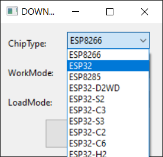
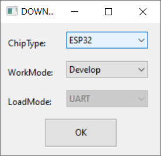
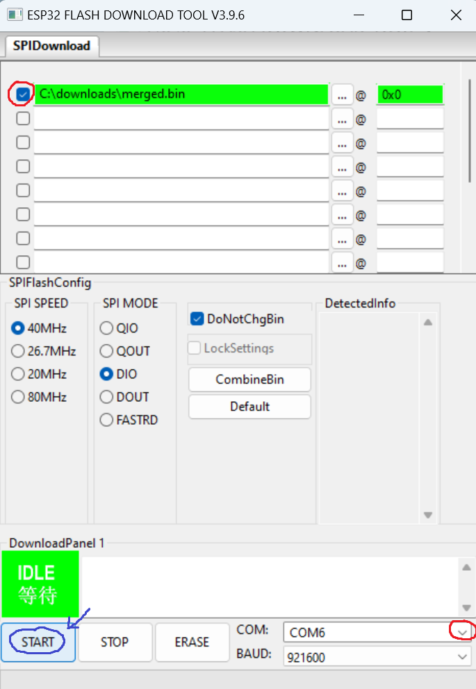

# Agon VDP Binaries
This git contains flashable VDP binaries for the Agon platform.

## Where can I find MOS binaries?
- The latest [Console8 MOS](https://github.com/AgonConsole8/agon-mos/releases/latest/download/MOS.bin)
- The latest [Quark MOS](https://github.com/breakintoprogram/agon-mos/releases/latest/download/MOS.bin)

## Flashing VDP
The VDP can be flashed in several ways:
1. By using the [web programmer](https://envenomator.github.io/) (Easy - recommended)
2. By using one of the commandline [scripts](#using-the-supplied-commandline-script) from this repository (Fast)
3. By using the graphical 'ESP32 Flash Download Tool' from Espressif. This option is for experienced users and requires a Windows PC. See [details](#using-the-esp-flash-download-tool-windows) below.
### Using the supplied commandline script
This option is highly recommended, because there is very little chance of user-error. Download this repository first, launch a shell and change directory to the VDP subdirectory.

Each VDP version directory has both a Windows Batchfile and Unix shell script to flash the ESP32 using Espressif's esptool. The redistributable esptool.exe is provided for Windows. The Unix version requires the installation of esptool.py with 'pip install esptool'

#### Windows batch file
After changing directory to the VDP firmware you would like to flash, use the script with the following parameters:

    .\flash.bat [COM_PORT] <BAUDRATE>

#### Unix script
After downloading the unix shell script, it's line-endings may have been mangled by git. This can be fixed by using

    sed -i -e 's/\r$//' flash.sh

It is probably also necessary to make the script itself executable by setting the execute bit to the file:

    chmod +x flash.sh

After changing directory to the VDP firmware you would like to flash, use the script with the following parameters:

    sudo ./flash.sh [SERIAL_PORT] <BAUDRATE>

### Using the ESP Flash download tool (Windows)
This option is only documented for experienced users, who know exactly what they are doing. There is a significant chance of incorrect parameter feeding, potentially rendering your board to an unusable state. It also appears this tool has bugs unfixed by the vendor, that the command-line version of esptool.exe (used in a script in the previous option) doesn't have.

The latest version of this tool can be downloaded [from the Espressif support website](https://www.espressif.com/en/support/download/other-tools?keys=&field_type_tid%5B%5D=13)

Connect your AgonLight board to your PC, using an appropriate USB interface cable. This will provide serial connectivity between the ESP32 on your AgonLight and the PC.

After installation of the Espressif ESP Flash download tool, run it and fill in the fields as follows:

Select the **ESP32** platform for *Chiptype*:

Leave **WorkMode** at *Develop*:

Next, on the main screen, take care to specify these exact addresses for:

|    Filename    | Address |
|:--------------:|--------:|
| merged.bin     |     0x0 |

And **make sure** to **SELECT** the checkboxes on the left, to select all files to flash.

- SPI speed is 40Mhz
- SPI mode can be DIO, or QIO
- Please don't use the CombineBin/Default buttons
- Leave the *DoNotChgBin* option selected
- provide your own serial port details from the **DROPDOWN** and don't type it in.
 
Then press 'Start' and wait for the tool to finish. It might be necessary to press the 'reset' button after the tool is done.